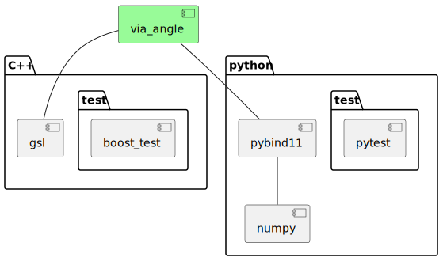

# via-angle-cpp

[](https://opensource.org/license/mit/)
[](https://github.com/kenba/via-angle-cpp/actions)
[](https://codecov.io/gh/kenba/via-angle-cpp)

A C++ library for performing accurate and efficient trigonometry calculations.

## Description

The standard trigonometry functions: `sin`, `cos`, `tan`, etc.
[give unexpected results for well-known angles](https://stackoverflow.com/questions/31502120/sin-and-cos-give-unexpected-results-for-well-known-angles#answer-31525208).  
This is due to floating-point [round-off errors](https://en.wikipedia.org/wiki/Round-off_error)
and the functions taking parameters in `radians` instead of `degrees`.
The conversion from `degrees` to `radians` (and vice-versa) suffers from `round-off error`
because `radians` is based on the irrational number π.

This library uses the [remquo](https://en.cppreference.com/w/cpp/numeric/math/remquo)
function to provide a [sincos](src/trig.rs#sincos) function to calculate more
accurate values than the standard `sin` and `cos` functions for angles in `radians`
and a [sincosd](src/trig.rs#sincosd) function to calculate more accurate values
for angles in `degrees`.

The library also provides an [Angle](#angle) class which represents an angle
by its sine and cosine as the coordinates of a
[unit circle](https://en.wikipedia.org/wiki/Unit_circle), see *Figure 1*.

  
*Figure 1 Unit circle formed by cos *θ* and sin *θ**

The `Angle` class enables more accurate calculations of angle rotations and
conversions to and from `degrees` or `radians`.

## Features

* `Degrees`, `Radians` and `Angle` types;
* functions for accurately calculating sines and cosines of angles in `Degrees` or `Radians`
using [remquo](https://en.cppreference.com/w/cpp/numeric/math/remquo);
* functions for accurately calculating sines and cosines of differences of angles in `Degrees` or `Radians`
using the [2Sum](https://en.wikipedia.org/wiki/2Sum) algorithm;
* functions for accurately calculating sums and differences of `Angles` using
[trigonometric identities](https://en.wikipedia.org/wiki/List_of_trigonometric_identities#Angle_sum_and_difference_identities);
* and some [spherical trigonometry](https://en.wikipedia.org/wiki/Spherical_trigonometry) functions.

The following example shows the `round-off error` inherent in calculating angles in `radians`.
It calculates the correct sine and cosine for 60° and converts them back
precisely to 60°, but it fails to convert them to the precise angle in `radians`: π/3.

```C++
#include "via/angle.hpp"
#include <boost/test/unit_test.hpp>

using namespace via;

namespace {
constexpr auto EPSILON{std::numeric_limits<double>::epsilon()};
constexpr auto CALCULATION_TOLERANCE{101 * EPSILON};
constexpr auto PI_3{ trig::PI_3 <double> };
constexpr auto COS_30_DEGREES{ COS_30_DEGREES <double> };
} // namespace

BOOST_AUTO_TEST_SUITE(Test_angle)

BOOST_AUTO_TEST_CASE(test_Angle_conversion) {
  const Angle angle_60(Degrees(60.0));
  BOOST_CHECK(angle_60.is_valid());
  BOOST_CHECK_EQUAL(COS_30_DEGREES, angle_60.sin().v());
  BOOST_CHECK_EQUAL(0.5, angle_60.cos().v());
  BOOST_CHECK_EQUAL(Degrees(60.0), angle_60.to_degrees());
  // Fails because PI is irrational
  // BOOST_CHECK_EQUAL(Radians(PI_3), angle_60.to_radians());
  BOOST_CHECK_CLOSE(PI_3, angle_60.to_radians().v(),
                    CALCULATION_TOLERANCE);
}

BOOST_AUTO_TEST_SUITE_END()
```
The following example calculates the sine and cosine between the difference
of two angles in `degrees`: -155° - 175°.
It is more accurate than calling the `Angle` constructor in the example above
with the difference in `degrees`.
It is particularly useful for implementing the
[Haversine formula](https://en.wikipedia.org/wiki/Haversine_formula)
which requires sines and cosines of both longitude and latitude differences.
Note: in this example sine and cosine of 30° are converted precisely to π/6.

```C++
#include "via/angle.hpp"
#include <boost/test/unit_test.hpp>

using namespace via;

namespace {
constexpr auto EPSILON{std::numeric_limits<double>::epsilon()};
constexpr auto CALCULATION_TOLERANCE{101 * EPSILON};
constexpr auto PI_6{ trig::PI_6 <double> };
constexpr auto COS_30_DEGREES{ COS_30_DEGREES <double> };
} // namespace

BOOST_AUTO_TEST_SUITE(Test_angle_difference)

BOOST_AUTO_TEST_CASE(test_Angle_difference_conversion) {
  const Angle angle_d30(Degrees(-155.0), Degrees(175.0));
  BOOST_CHECK(angle_d30.is_valid());
  BOOST_CHECK_EQUAL(0.5, angle_d30.sin().v());
  BOOST_CHECK_EQUAL(COS_30_DEGREES, angle_d30.cos().v());
  BOOST_CHECK_EQUAL(Degrees(30.0), angle_d30.to_degrees());
  BOOST_CHECK_EQUAL(Radians(PI_6), angle_d30.to_radians());
}

BOOST_AUTO_TEST_SUITE_END()
```

## Design

### Trigonometry Functions

The [trig](include/via/trig.hpp) namespace contains accurate and efficient trigonometry functions.

### Angle

The `Angle` struct represents an angle by its sine and cosine instead of in
`degrees` or `radians`, see *Figure 2*.

  
*Figure 2 Angle Class Diagram*

This representation an angle makes functions such as
rotating an angle +/-90° around the unit circle or calculating the opposite angle;
simple, accurate and efficient since they just involve changing the signs
and/or positions of the `sin` and `cos` values.

`Angle` `Add` and `Sub` traits are implemented using
[angle sum and difference](https://en.wikipedia.org/wiki/List_of_trigonometric_identities#Angle_sum_and_difference_identities)
trigonometric identities,
while `Angle` [double](https://en.wikipedia.org/wiki/List_of_trigonometric_identities#Double-angle_formulae)
and [half](https://en.wikipedia.org/wiki/List_of_trigonometric_identities#Half-angle_formulae) methods use other
trigonometric identities.

The `sin` and `cos` fields of `Angle` are `UnitNegRange`s:,
a [newtype](https://rust-unofficial.github.io/patterns/patterns/behavioural/newtype.html)
with values in the range -1.0 to +1.0 inclusive.

## Use

The C++ software depends on the Microsoft [GSL](https://github.com/microsoft/GSL) library
to provide [Contracts](https://isocpp.org/files/papers/P2900R6.pdf) support.  
The C++ tests use the [boost.test](https://www.boost.org/doc/libs/1_86_0/libs/test/doc/html/boost_test/intro.html)
library, see *Figure 3*.

  
*Figure 3 Angle Software Dependencies*

Note: Python bindings do not require `boost`, just `GSL`.

### C++

#### Installation

The library is header only, so the library `include` directory just needs to be added to the include path.  
Alternatively, when using [cmake](https://cmake.org/) the environment variable `ViaAngle_DIR` just needs
to be set to the location of the `via-angle-cpp` directory; `cmake` will add it to the include path.

Note: `CMakeLists.txt` is setup to install python by default, so `-DINSTALL_PYTHON=OFF`
must be passed to `cmake` when building for C++.

`cmake` can also be used to install the library to the relevant include directory on Linux/macOS.  
In the `via-angle-cpp` directory, run:

```bash
cmake -DINSTALL_PYTHON=OFF .
sudo make install
```

Note: it will be necessary to delete the `CMakeCache.txt` file created by
running `cmake` above, before running `cmake` on this library again.

#### Tests

The C++ tests can be built and run using `cmake` by running:

```bash
cmake -DCMAKE_EXPORT_COMPILE_COMMANDS=1 -DINSTALL_PYTHON=OFF -DCPP_UNIT_TESTS=ON <via-angle-cpp directory>
make
make test
```

Note: `-DCMAKE_EXPORT_COMPILE_COMMANDS=1` creates a `compile_commands.json`
file which can be copied back into the `via-angle-cpp` directory for
[clangd](https://clangd.llvm.org/) tools.

### Python

The library uses [pybind11](https://github.com/pybind/pybind11) to provide C++ Python bindings
and [scikit-build](https://pypi.org/project/scikit-build/) to build a python package using
[cmake](https://cmake.org/).

From the parent directory of `via-angle-cpp`, run:

```bash
pip install ./via-angle-cpp
```

In Python code import the software as `via_angle`, e.g.:

```python
from via_angle import Angle, Degrees, Radians 
```

See: [test_Angle.py](python/tests/test_Angle.py).

## License

`via-angle-cpp` is provided under a MIT license, see [LICENSE](LICENSE).
